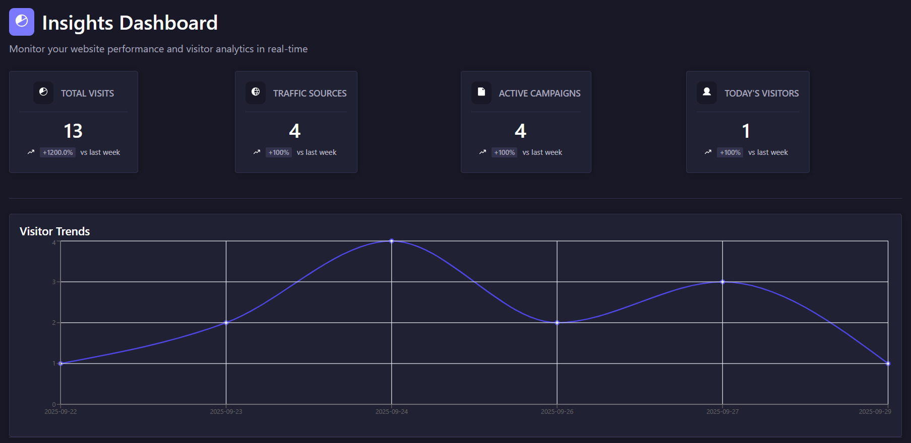
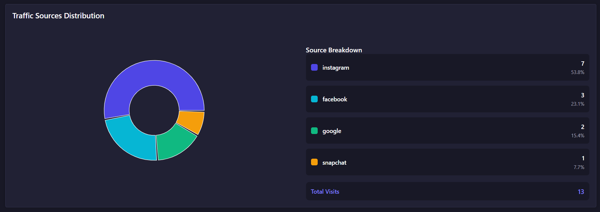

<p align="center">
  
</p>

# Insights

**A Strapi plugin to capture visitor insights such as source, medium, campaign, path, IP, user agent, and platform (app/website).**

---

## Table of Contents

- [Description](#description)  
- [How to Install](#how-to-install)  
- [Usage](#usage)  
- [Environment Variable](#environment-variable)  
- [Captured Parameters](#captured-parameters)  
- [Ignore Admin Routes](#ignore-admin-routes)  
- [Example Frontend Request with UTM Parameters](#example-frontend-request-with-utm-parameters)
- [Reference screenshots](#reference-screenshots)
---

## Description

**Insights** is a Strapi plugin that automatically logs visitor requests and analytics. It captures:

- UTM parameters (`source`, `medium`, `campaign`, `term`, `content`)  
- Path of the request  
- IP address  
- User agent  
- Platform (`via` – `app` or `website`)  

The plugin ignores Strapi admin routes by default, so it only tracks **public-facing API requests**.

This plugin is useful for monitoring traffic, marketing campaigns, or building custom analytics dashboards.

---

## How to Install

Copy the following code and run from your terminal:

```bash
yarn add insights
```

or

```bash
npm i insights
```

After installation, rebuild Strapi:

```bash
npm run build
npm run develop
```

---

## Usage

The plugin automatically tracks requests when configured. You do **not** need to manually call any API. Every request to your frontend APIs will be logged in the plugin's content-type (`Insights`).

---

### Environment Variable

To enable/disable the plugin globally, add this to your `.env` file:

```env
INSIGHTS_ENABLED=true
```

- `INSIGHTS_ENABLED=true` → Insights tracking is **enabled** (default behavior).  
- `INSIGHTS_ENABLED=false` → Insights tracking is **disabled** (no requests will be logged).  

---

## Captured Parameters

The plugin tracks the following fields in the **`insight` collection type**:

| Field       | Description                                            |
|------------|--------------------------------------------------------|
| `source`   | UTM source (e.g., google, facebook, newsletter)       |
| `medium`   | UTM medium (e.g., social, email, cpc)                |
| `campaign` | UTM campaign name                                      |
| `term`     | UTM term (optional, usually for paid keywords)        |
| `content`  | UTM content (optional, for A/B testing or creatives)  |
| `path`     | The requested URL path                                  |
| `ip`       | Visitor IP address                                     |
| `user_agent` | Browser/OS information                               |
| `via`      | Platform (`app` or `website`)                          |

---

## Ignore Admin Routes

By default, the plugin ignores:

- `/admin`  
- `/content-manager`  
- `/users-permissions`  

You can extend or customize the ignore list in the middleware code if needed.

---

## Example Frontend Request with UTM Parameters

When a user visits a URL with UTM parameters:

```
https://www.example.com/page?source=snapchat&medium=social&campaign=buffer&term=summer&content=banner&via=app
```

The plugin will automatically log the following in the Strapi **Insights** collection:

```json
{
  "source": "snapchat",
  "medium": "social",
  "campaign": "buffer",
  "term": "summer",
  "content": "banner",
  "ip": "192.168.1.1",
  "user_agent": "Mozilla/5.0 ...",
  "path": "/page",
  "via": "app"
}
```

This allows you to track campaign performance, user activity, and platform usage effortlessly.

---

## Reference screenshots

<p align="center">
  
</p>

<p align="center">
  
</p>

---
